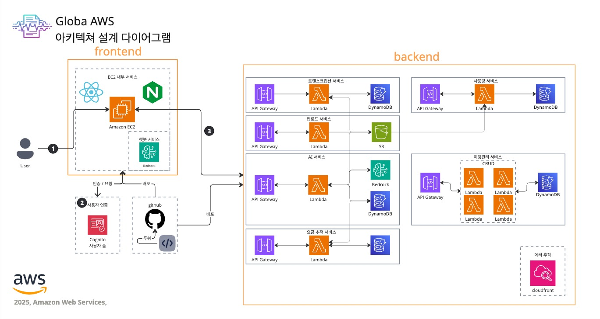

# galoba-note / 글로바-노트

## 0. GitHub → GitHub Actions 배포 파이프라인

* 개발자는 GitHub 저장소에 코드를 **푸시**합니다.
* **GitHub Actions**가 트리거되어 테스트·빌드·배포 단계를 자동 수행합니다.
* Blue/Green 무중단 배포 전략으로 서비스 안정성을 확보합니다.

## 1. DNS → Nginx(Proxy) → React SPA 렌더링

* 사용자가 브라우저에 도메인을 입력하면 443/HTTPS 트래픽이 **EC2 인스턴스**로 전달됩니다.
* 인스턴스 내부 **Nginx**가 Reverse Proxy 역할을 수행하고, **React SPA** 정적 자산을 즉시 응답합니다.
* Certbot + Nginx로 TLS 인증서를 자동 갱신합니다.

## 2. 로그인·회원가입(인증)

* **Cognito 사용자 풀**을 통해 OAuth2 로그인 및 회원가입을 처리합니다.
* 액세스 토큰·ID 토큰을 발급하여 SPA가 API 호출 시 Authorization 헤더에 포함합니다.

## 3. 여섯 개 서비스 흐름

| # | 서비스                      | 주요 단계                                                                                  |
| - | ------------------------ | -------------------------------------------------------------------------------------- |
| 1 | **회의 녹음 → 화자 분리 → 텍스트화** | Presigned URL로 업로드된 녹음 파일을 Transcribe → Lambda 파이프라인에서 화자 분리·텍스트 변환 후 **DynamoDB**에 저장 |
| 2 | **파일 업로드(Presign URL)**  | **Lambda**가 Presigned URL을 발급하고 사용자가 S3 버킷에 파일 업로드                                     |
| 3 | **AI 요약 & 분류**           | 트랜스크립션 JSON을 **Bedrock**에 전달하여 요약·회의 유형 분류 후 결과를 DynamoDB에 저장                          |
| 4 | **요금 추적 서비스**            | API 호출·토큰 사용량을 집계하여 **대시보드**에 월별 비용 시각화                                                |
| 5 | **사용자 추적 서비스**           | 트랜스크립션 길이·참여 시간 등을 수집해 사용자 활동 리포트 생성                                                   |
| 6 | **미팅 관리 서비스**            | 미팅 제목·본문·참가자·일시를 CRUD API(**Lambda ×4**)로 관리하고 **캘린더** 뷰에 연동                           |

---

## 정리

Globa‑note 아키텍처는 SPA + Serverless 조합으로 확장성과 비용 효율을 모두 충족합니다. 여섯 개 서비스는 API Gateway → Lambda → DynamoDB/S3 → Bedrock 흐름으로 느슨하게 결합되어 있으며, GitHub Actions를 통해 안전하게 배포됩니다.

